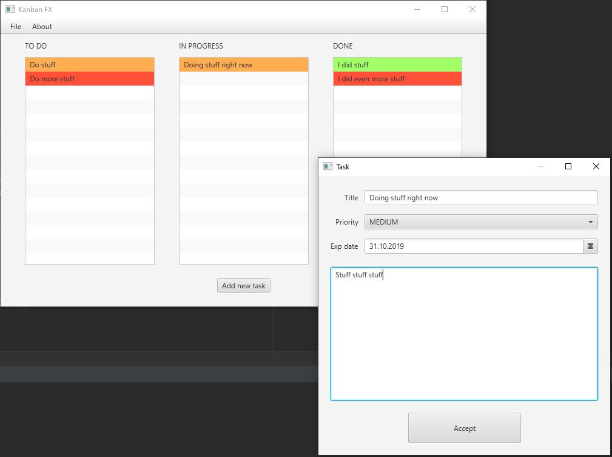
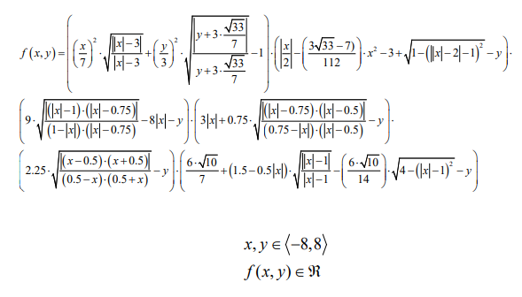
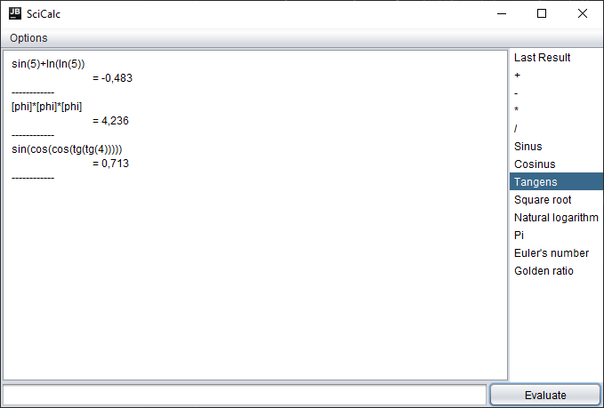

# Basics of Multithreading

Program counts primary numbers on thread 1 and shows a picture on thread 2.

# KanbanFX

A Kanban in JavaFX

Features:
  a. Saving to the application status file by serialization of TODO, INPROGRESS, DONE lists
  b. Reading the status from a file by deserializing lists
  c. Exporting lists to a file in CSV format
  d. Import lists from a CSV file

# Monte Carlo

Multi-threaded program calculating the integral of

and drawing its graph on the screen

# Picture Editor API

Remote image editing using spring boot. Image scaling, color change, blur effect etc.

# Sci-Calculator

Implementation of a scientific calculator with command recognition based on mXparser library.

Done with Swing.

# SpringBoot + Hibernate  Survey System

Basic API connected to the database by Hibernate.

# Subnet Calculator

Program calculates network class, broadcast addres, mask, first host address, last host address etc.

